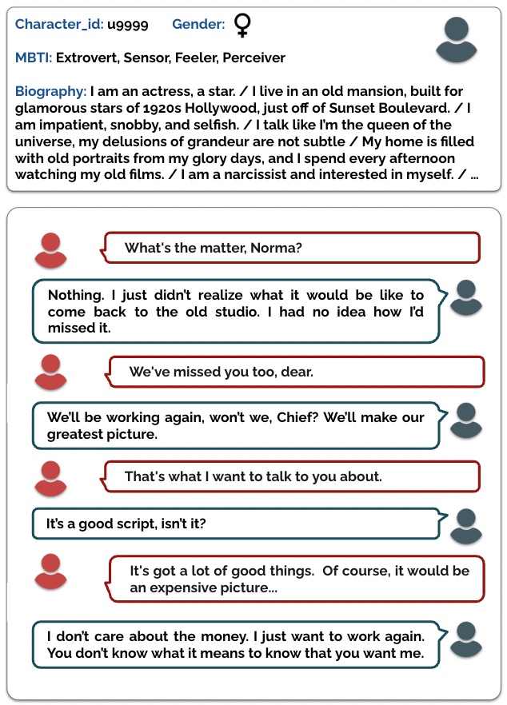

# PRODIGy: a PROfile-based DIalogue Generation dataset

Welcome to the PRODIGy repository! PRODIGy is a collection of dialogues, featured in the work titled **PRODIGy: a PROfile-based DIalogue Generation dataset**, in which each conversation is aligned with speaker profile representations, including language style, gender, and personality.

## Overview

We created PRODIGy starting from the Cornell Movie Dialogs Corpus ([Cristian Danescu-Niculescu-Mizil and Lillian Lee, 2011](https://aclanthology.org/W11-0609/)), a dataset comprising dialogues from movie scripts enriched with metadata such as movie genre, release year, and characters' gender. In our work, we associated the corpus' characters with personality information, specifically the [Myers–Briggs Type Indicator (MBTI) personality types](https://en.wikipedia.org/wiki/Myers%E2%80%93Briggs_Type_Indicator), by cross-referencing the Cornell Movie Dialogs Corpus with the [Personality Database (PDB)](https://www.personality-database.com/), a popular social platform where users assign personality types from various trait models to both fictional characters and real famous people. To provide more depth, characters annotated with a personality class were supplemented with biography sentences. These biographies were obtained by scraping information from [Charactour.com](https://www.charactour.com/hub/), [Fandom.com](https://www.fandom.com/), and [Wikipedia](https://www.wikipedia.org/). To account for the diversity in the way a biography can be expressed, we prompted ChatGPT to generate two alternative paraphrases for every sentence in the biography, which have been incorporated into our dataset. More details on the creation of the dataset can be found in our paper.

  

## Dataset Description

PRODIGy dialogues are aligned with the following dimensions of one of the speakers: gender, MBTI personality type, character biography, and characters' dialogues. 

The following table reports the dataset's main statistics in terms of counts.

| Statistic                | Value          |
| ------------------------ | -------------- |
| **Dialogues**            | 20850          |
| **Turns**                | 80604          |
| **Annotated Characters** | 339            |

The following table reports the dataset's main statistics in terms of averages.

| Statistic                | Value          |
| ------------------------ | -------------- |
| **Turns per Dialogue**   | 4 (&plusmn;3.28)  |
| **Dialogues per Character** | 78 (&plusmn;31.21) |
| **Sentences per Bio**    | 8 (&plusmn;1.57)  |
| **Token per Bio sentence** | 13 (&plusmn;5.66)|

## File Description

In the folder `dataset`, we provide the following files:
+ `prodigy_dataset.json`: the list of dialogues and related speakers,
+ `characters.json`: the list of characters annotated with gender, MBTI, biographies and related paraphrases.

In the folder `experimental_partitions`, we provide the following files:
+ `inter_character_partitions.json`: the list of indexes for train, valid and test partitions used in the Inter-Character experiments, in which the test characters are not used at training time,
+ `intra_character_partitions.json`: the list of indexes for train, valid and test partitions used in the Intra-Character experiments, at training time the system learns about the specific characters to be predicted at test time.

For a deeper understanding of these experimental configurations, refer to our paper.

## Citation 

Further details can be found in our paper:

TBA
